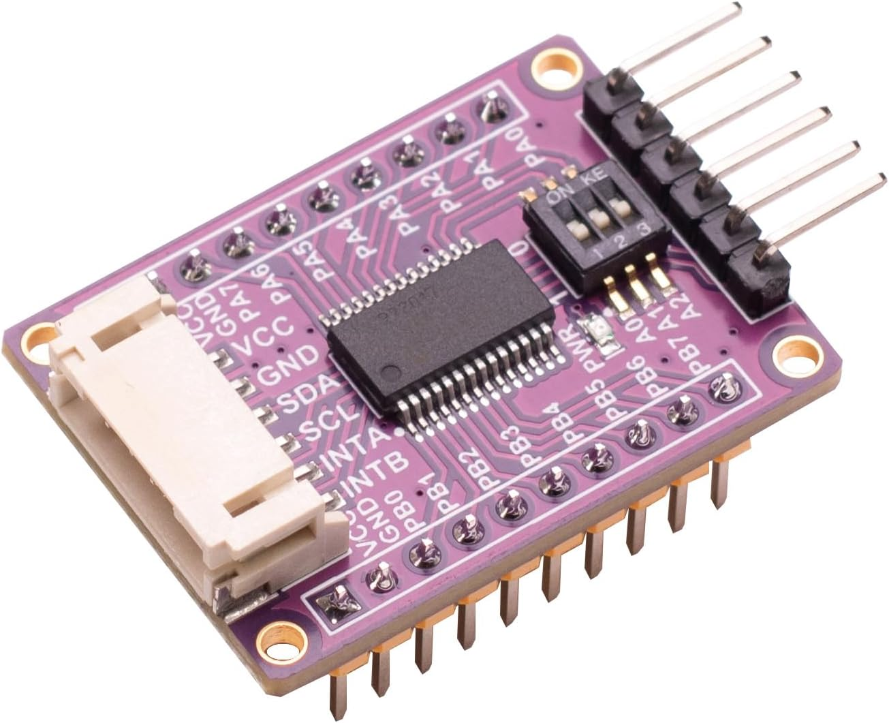

# MCP23017 ADC Arduino library

Arduino library for Microchip MCP23017 IO expander using I2C.<br>
The IO expander gives you additional 16 Inputs or Outputs.<br>
The chip has two banks, GPAx (pin 0 ... 7) and GPBx (pin 8 ... 15).<br>

## Credits
This library is based on a library of the same name by Stefan Staub.
The code is substantially still Stefan's, I have only added a couple 
of missing functions, and renamed a couple more to be more descriptive
of their actual function. 

You can find [Stefan's work here](https://github.com/sstaub/MCP_23017)
    

```
          --------    
GPB0 (0) -|1   28|- GPA7 (15)
GPB1 (1) -|2   27|- GPA6 (14)
GPB2 (2) -|3   26|- GPA5 (13)
GPB3 (3) -|4   25|- GPA4 (12)
GPB4 (4) -|5   24|- GPA3 (11)
GPB5 (5) -|6   23|- GPA2 (10)
GPB6 (6) -|7   22|- GPA1 (9)
GPB7 (7) -|8   21|- GPA0 (8)
VDD  (+) -|9   20|- INTA
VSS  GND -|10  19|- INTB
NC       -|11  18|- RESET (+)
SDK      -|12  17|- A2
SDA      -|13  16|- A1
NC       -|14  15|- A0
          --------
```
I2C bus device address setting:
```
0 1 0  0 A2 A1 A0 
0 1 0  0 0  0  0    0x20
0 1 0  0 0  0  1    0x21
0 1 0  0 0  1  0    0x22
0 1 0  0 0  1  1    0x23
0 1 0  0 1  0  0    0x24
0 1 0  0 1  0  1    0x25
0 1 0  0 1  1  0    0x26
0 1 0  0 1  1  1    0x27
```

## Example
Here is a simple example which shows the capabilities of the library.<br>
Attach two LED's to pin 0 and 1 (bank GPA0 and GPA1)
and two buttons to pin 8 and 9 (bank GPB0 and GPB1).

```cpp
#include "MCP23017.h"

MCP23017 mcp;

void setup() {
	mcp.begin();
	mcp.pinMode(8, INPUT_PULLUP);
	mcp.pinMode(9, INPUT_PULLUP);
	mcp.pinMode(0, OUTPUT);
	mcp.pinMode(1, OUTPUT);
	mcp.digitalWrite(0, LOW);
	mcp.digitalWrite(1, LOW);
	}

void loop() {
	mcp.digitalWrite(0, !mcp.digitalRead(8));
	mcp.digitalWrite(1, !mcp.digitalRead(9));
	}
```

# Documentation

## Constructor

Create an IO expander object.

```cpp
MCP23017(uint8_t i2cAddr = 0);
```

- **i2cAddr** 0 ... 7, default 0, see data sheet 

**Example**

```cpp
MCP23017 mcp;
```

## Methods

### **begin()**

```cpp
void begin(TwoWire &wire = Wire);
```

- **spi** set optional I2C class to use (I2C, I2C1, ...)

Initialize the I2C communication of the IO expander.<br>
This must done in ```setup()```

**Example**

```cpp
setup() {
  mcp.begin(); // default I2C class
  mcp.begin(I2C1); // use I2C1 class
  }
```

### **pinMode()**

Set the pin mode.

```cpp
void pinMode(uint8_t pin, uint8_t mode);
```

- **pin** digital input (0 ... 15) to read
- **mode** mode INPUT / INPUT_PULLUP / OUTPUT

**Example**

```cpp
mcp.pinMode(8, INPUT_PULLUP);
mcp.pinMode(0, OUTPUT);
```

### **digitalRead()**

Read a digital pin. Returns the value (HIGH / LOW, 0 / 1, true /false).

```cpp
uint8_t digitalRead(uint8_t pin);
```

- **pin** digital input (0 ... 15) to read

**Example**

```cpp
uint8_t input1 = mcp.digitalRead(8);
```

### **digitalWrite()**

Write to a single digital output.

```cpp
void digitalWrite(uint8_t pin, uint8_t value);
```

- **pin** digital output (0 ... 15) to write

**Example**

```cpp
mcp.digitalWrite(0, LOW);
```

### **interruptSetup()**

Setup the interrupts.

```cpp
void interruptSetup(uint8_t mirroring, uint8_t open, uint8_t polarity);
```

- **mirroring** OR both INTA and INTB pins
- **openDrain** set the INT pin to value or open drain
- **polarity**  set LOW or HIGH on interrupt

### **enableInterruptPin()**

Set the interrupt pin and it's mode.

```cpp
void enableInterruptPin(uint8_t pin, uint8_t mode);
```

- **pin** interrupt pin (0 ... 15)
- **mode** mode CHANGE, FALLING, RISING

### **disableInterruptPin()**

Disable interrupts for a pin

```cpp
void disableInterruptPin(uint8_t pin);
```

- **pin** interrupt pin (0 ... 15)
### **getLastInterruptPin()**

Return the last pin an interrupt occurs. Returns the number of the pin.

```cpp
uint8_t getLastInterruptPin();
```

### **getLastInterruptValue()**

Returns the value of the last interrupted pin(HIGH / LOW, 0 / 1, true /false).

```cpp
uint8_t getLastInterruptValue();
```

### **void clearInterrupts()**

Clears outstanding interrupts
```cpp
void clearInterrupts();
```
